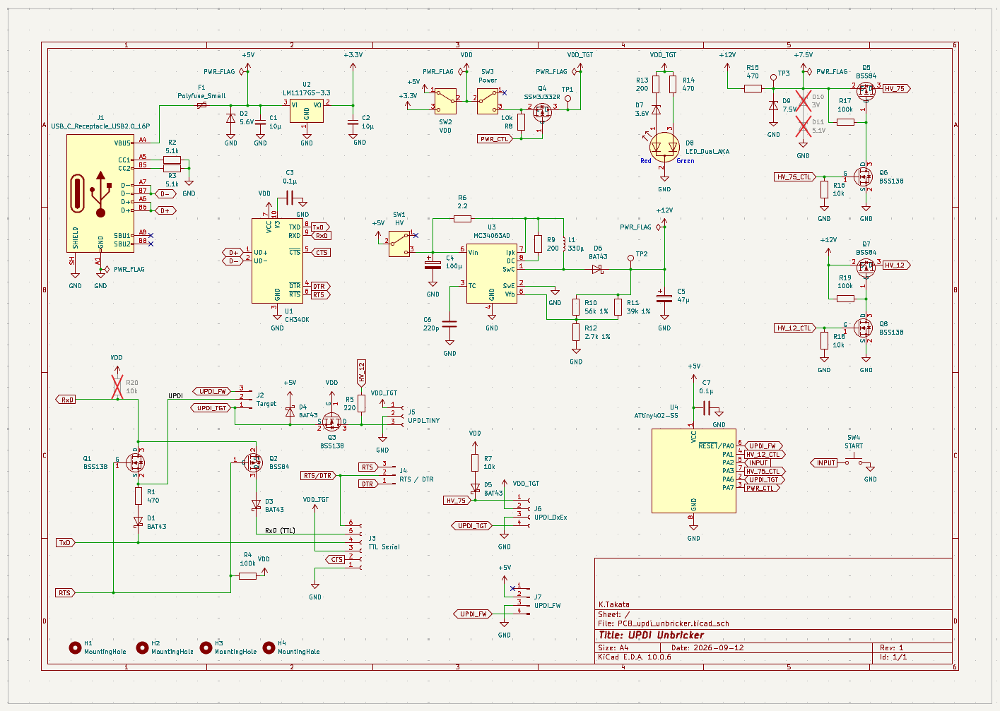
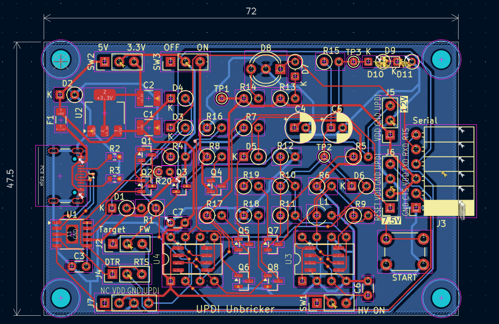
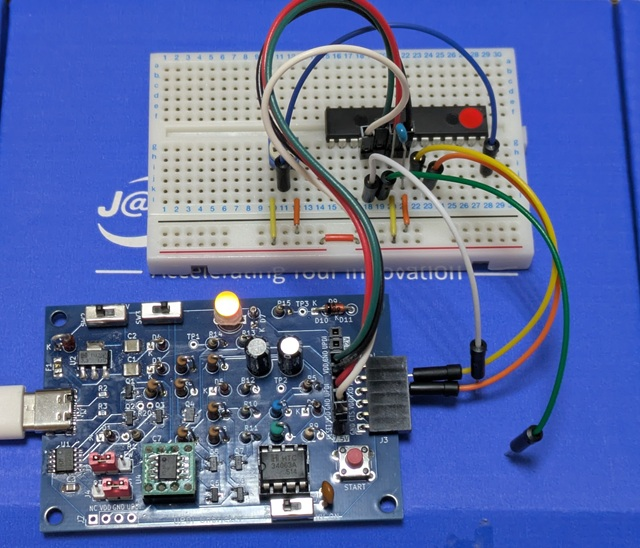

[English](README.md) | [日本語](README.ja.md)

# UPDI Unbricker

## 概要

AVR Dx/Exシリーズの7.5V高電圧(HV)プログラミング、およびモダンATtinyシリーズ(tinyAVR 0/1/2シリーズ)の12V HVプログラミングに対応したUPDI (Unified Program and Debug Interface)書き込み装置です。
意図的あるいは事故によりUPDIピンの設定を変更してしまい、通常のUPDI書き込み装置で書き込みができなくなってしまったデバイスに対し、HVパルスを注入することで、再度書き込みができるようにします。

UPDI部分の回路は[UPDI Adapter for AE-CH9102F (Rev. 2)](https://github.com/k-takata/PCB_UPDI_for_AE-CH9102F)の回路を使用しており、RTS信号による自動切り替え機能を備えています。


## 対応範囲

| 項目 | 対応状況 | 備考 |
|------|----------|------|
| AVR Dx/Exの7.5V HV UPDI | 対応 | RESETピンへ7.5Vパルスを印加する方式 |
| ATtinyの12V HV UPDI | 対応 | UPDIピンへ12Vパルスを印加する方式 |
| 通常のUPDI書き込み | 対応 | 書き込み装置はSerialUPDIを使用 |
| 動作確認済みデバイス | T.B.D. | README作成時点 |


## 使用したソフトウェア

* KiCad 10.0
* Arduino IDE 2.3.10
  - [megaTinyCore](https://github.com/SpenceKonde/megaTinyCore) 2.6.11


## スイッチとジャンパーの役割

本基板では、3つのスイッチと1つのジャンパーで動作モードを切り替えます。

| 部品 | 役割 | 主要設定 |
|------|------|----------|
| SW1 | HVパルス発生の有効/無効 | OFF = 安全モード, ON = HVプログラミング実行 |
| SW2 | ターゲットへの供給電圧選択 | 5V / 3.3V を選択 |
| SW3 | 本機からターゲットへの給電有無 | ON = 給電, OFF = 外部給電時の重複回避 |
| J2 | 書き込み先切替え | FW = ファームウェア書込み, Target = ターゲット書込み |

J2は、ファームウェア書き込み時には FW 側、UPDI書込み時には Target 側に設定します。
「FW」側の状態ではU4へ書き込むための接続になり、「Target」側の状態ではターゲットに対してUPDI通信やHVプログラミングを行います。


## クイックスタート

初回のみ、先に本基板側マイコン(U4)へファームウェアを書き込んでください。

1. J2を**FW**側に設定する。
2. Arduino IDEで`src/updi_unbricker/updi_unbricker.ino`を開き、ボードとChipを適切に選択する。
3. 書き込み装置をSerialUPDIに設定して、U4へファームウェアを書き込む。
4. 書き込み後、J2を**Target**側へ戻す。
5. ターゲットに合わせてJ5/J6のいずれかを接続し、必要に応じてSW2, SW3を設定する。(ターゲットへ本基板から給電するならON)
6. SW1をONにしてHV回路をオンにし、STARTボタンを押してHVパルスを注入する。
7. Arduino IDEで書き込み装置をSerialUPDIに設定し、通常の書き込みを実行する。

詳細手順は「使用方法」を参照してください。


## 安全上の注意

* J5のUPDIピンには12VのHVパルスが出力されます。また、J6のRESETピンには7.5VのHVパルスが出力されます。ターゲット回路の耐圧・保護回路を必ず確認してください。
* 外部電源でターゲットを給電している場合は、SW3をOFFにして二重給電を避けてください。
* HV実行時はJ3を未接続にする構成を推奨します。
* 初回はターゲット基板ではなく、可能ならチップ単体や最小構成で動作確認してください。


## 回路図

[](images/schema.pdf)


## 基板パターン図




## 部品表

| Reference |個数|値    | 説明 |
|-----------|----|------|------|
|C1,C2      |   2|10μF |3225Mまたは3216M |
|C3,C7      |   2|0.1μF| |
|C4         |   1|100μF|≧47μF, ≧10V |
|C5         |   1|47μF |≧47μF, ≧25V |
|C6         |   1|220pF |150pF - 470pF|
|D1,D3-D6   |   5|[BAT43](https://akizukidenshi.com/catalog/g/g113907/) |適当なショットキーバリアダイオード (他の例: [SD103A](https://akizukidenshi.com/catalog/g/g104271), [11EQS03L](https://akizukidenshi.com/catalog/g/g108997/))|
|D2         |   1|      |5.6Vツェナーダイオード、過電圧保護用|
|D7         |   1|      |3.6Vツェナーダイオード、LEDに合わせて値は適宜調整 (3.0 - 3.6V)|
|D8         |   1|[OSRGHC5B32A](https://akizukidenshi.com/catalog/g/g106314/)|2色LED (赤・緑) カソードコモン、φ5mm、VDD電圧インジケーター|
|D9         |   1|[1N4737A](https://www.sengoku.co.jp/mod/sgk_cart/detail.php?code=EEHD-0FMV)|7.5Vツェナーダイオード (\*1) |
|D10        |   1|任意  |ツェナーダイオード (\*1) |
|D11        |   1|任意  |ツェナーダイオード (\*1) |
|F1         |   1|[MF-NSMF050-2](https://akizukidenshi.com/catalog/g/g115300/)|リセッタブルヒューズ 0.5A|
|J1         |   1|[5077CR-16-SMC2-BK-TR](https://akizukidenshi.com/catalog/g/g114356/)|USB Type-Cレセプタクル|
|J2         |   1|      |ピンヘッダー 1x3、書き込み先切り替え用|
|J3         |   1|      |[L型ピンソケット 1x6](https://akizukidenshi.com/catalog/g/g109862/)、TTLシリアル接続用|
|J5         |   1|      |ピンソケット 1x3、ATtiny UPDI接続用|
|J4         |   1|      |ピンヘッダー 1x3、RTS/DTR切り替え用|
|J6         |   1|      |ピンソケット 1x4、AVR Dx/Ex UPDI接続用|
|J7         |   1|      |ピンヘッダー 1x4、ファームウェア書き込み用 (\*2)|
|L1         |   1|330μH|100μH - 330μH, ≧100mA, [AL0307-331K](https://akizukidenshi.com/catalog/g/g103968/)等|
|Q1,Q3,Q6,Q8|   4|[BSS138](https://akizukidenshi.com/catalog/g/g104232/)|Nch MOSFET|
|Q2,Q5,Q7   |   3|[BSS84](https://akizukidenshi.com/catalog/g/g104269/) |Pch MOSFET|
|Q4         |   1|[SSM3J332R](https://akizukidenshi.com/catalog/g/g115985/)|Pch MOSFET|
|R1,R15     |   2|470Ω |黄紫茶金、1/4Wサイズ|
|R2,R3      |   2|5.1kΩ|1608M|
|R4,R17,R19 |   3|100kΩ|茶黒黄金、1/4Wサイズ (10kΩ - 100kΩ)|
|R5         |   1|4.7kΩ|黄紫赤金、1/4Wサイズ|
|R6         |   1|1.0Ω |茶黒金金、1/4Wサイズ|
|R7,R8,R16,R18| 4|10kΩ |茶黒橙金、1/4Wサイズ|
|R9         |   1|200Ω |赤黒茶金、1/4Wサイズ (150Ω - 220Ω)|
|R10        |   1|56kΩ 1% |緑青黒赤茶、1/4Wサイズ (\*3)|
|R11        |   1|39kΩ 1% |橙白黒赤茶、1/4Wサイズ (\*3)|
|R12        |   1|2.7kΩ 1%|赤紫黒茶茶、1/4Wサイズ (\*3)|
|R13        |   1|200Ω |赤黒茶金、1/4Wサイズ、LEDに合わせて値は適宜調整 (47 - 220Ω)|
|R14        |   1|470Ω |黄紫茶金、1/4Wサイズ、LEDに合わせて値は適宜調整|
|R20        | (1)|10kΩ |未実装 (茶黒橙金、1/6Wサイズ)|
|SW1-SW3    |   3|[SS-12D00G3](https://akizukidenshi.com/catalog/g/g115707/)|スライドスイッチ 1回路2接点 基板用|
|SW4        |   1|      |プッシュスイッチ|
|U1         |   1|[LM1117GS-3.3](https://akizukidenshi.com/catalog/g/g116989/)||
|U2         |   1|[CH340K](https://akizukidenshi.com/catalog/g/g116306/)||
|U3         |   1|[MC34063AN](https://akizukidenshi.com/catalog/g/g112016/)|(\*4)|
|U4         |   1|[ATtiny402-SS](https://akizukidenshi.com/catalog/g/g130009/)|(\*5)|

(\*1) D9を単独で使用するか、D10 + D11の組み合わせで使用する。TP1の電圧が7.5V (Vdd+2.0V以上、8.5V以下)になるようにする。例えば、3.0V + 5.1Vなどの組み合わせでもよいだろう。  
(\*2) ピンヘッダーを実装せず、ポゴピンなどを使うようにしてもよい。  
(\*3) R10とR11は並列接続されている。R10 + R11の合成抵抗と、R12の抵抗値の比が8.6になるように調整する。他の組み合わせとしては、R10に13kΩ、R11は未接続、R12に1.5kΩを推奨。
(\*4) [DIP版](https://akizukidenshi.com/catalog/g/g112016/)を載せるか、[SOP8版](https://akizukidenshi.com/catalog/g/g117573/)を直接載せるか、[SOP8変換基板](https://akizukidenshi.com/catalog/g/g105154)を介して載せるかのどれかを選択する。  
(\*5) ATtiny402を直接載せるか、[SOP8変換基板](https://akizukidenshi.com/catalog/g/g105154)を介して載せるかのどちらかを選択する。  


## UPDI HVプログラミングについて

UPDI (Unified Program and Debug Interface)は、比較的新しいAVRで使われる書き込み方式です。

UPDIには専用のピンを使用しますが、UPDIピンはfuseの設定でGPIOピンに変更することも可能です。しかし、UPDIを無効化してしまうと、次回UPDIで書き込みを行うには特殊な方法でUPDIを有効化する必要があります。そのための方法が高電圧(HV)プログラミングです。

HVプログラミングには2種類あり、1つはATtinyシリーズで使用されている、UPDIピンに12Vのパルスを与える方式で、もう1つはAVR Dx/Exシリーズで使用されている、RESETピンに7.5Vのパルスを与える方式です。

1. ATtinyシリーズ:  
   パワーオンリセット(POR)から8.8ms以内にUPDIピンに12Vパルス(100μs - 1ms)を与える。  
   PORから時間内にパルスを与えなければ、ピンの機能と干渉する可能性がある。
2. AVR Dx/Exシリーズ:  
   RESETピンに7.5Vパルス(10μs以上)を与えてから65ms以内にNVMPROGキーを送出する。  
   時間内にNVMPROGキーの送出まで終わらなければ、自動的にリセットが掛かる。  
   ATtinyとは異なり、独立したRESETピンが存在し、出力として使用することはできないので、PORからHVパルスまでの時間的制約はない。

本機は安全のため、ATtinyとAVR Dx/Exでは別のコネクターに接続するようになっています。
また処理を簡略化するため、ATtinyとAVR Dx/ExのどちらもPORを行ってからHVパルスを与え、その後、NVMPROGキーを送出するようになっています。PORはAVR Dx/Exには不要ですし、NVMPROGキーの送出はATtinyには不要ですが、悪影響はないはずです。

**参考資料:**

* [ATtiny202/204/402/404/406 Data Sheet](https://ww1.microchip.com/downloads/aemDocuments/documents/MCU08/ProductDocuments/DataSheets/ATtiny202-204-402-404-406-DataSheet-DS40002318A.pdf) [PDF]  
  "30. UPDI - Unified Program and Debug Interface" や "33. Electrical Characteristics" (33.18. UPDI Timing) などを参照。
* [AVR64DD32/28 Datasheet](https://ww1.microchip.com/downloads/aemDocuments/documents/MCU08/ProductDocuments/DataSheets/AVR64DD32-28-Complete-DataSheet-DS40002315.pdf) [PDF]  
  "34. UPDI - Unified Program and Debug Interface" や "36. Electrical Characteristics" (36.18. UPDI) などを参照。


## 動作確認済みデバイス

* T.B.D.


## 使用方法

### 接続

J1をPCと接続します。

ターゲットとはJ5またはJ6で接続します。
J5はATtiny用のコネクターです。

| Pin | 機能           |
|-----|----------------|
|   1 | VDD (5V/3.3V)  |
|   2 | GND            |
|   3 | UPDI (Max 12V) |

UPDIピンからは12VのHVパルスが出力されます。接続先の回路は、この電圧を耐えられる構成である必要があります。

J6はAVR Dx/Exシリーズ用のコネクターで、[AVR Programming Adapter](https://www.microchip.com/en-us/development-tool/AC31S18A)と同じUPDI v2コネクターです。

| Pin | 機能             | 色 |
|-----|------------------|----|
|   1 | RESET (Max 7.5V) | 白 |
|   2 | VDD (5V/3.3V)    | 赤 |
|   3 | GND              | 黒 |
|   4 | UPDI             | 緑 |

RESETピンからは7.5VのHVパルスが出力されます。接続先の回路は、この電圧を耐えられる構成である必要があります。

J3は一般的な6ピンTTLシリアルコネクターです。J3の6番ピンはJ4にジャンパーピンを挿すことで、RTSまたはDTRのどちらかを選択できます。

| Pin | 機能          | 色 |
|-----|---------------|----|
|   1 | GND           | 黒 |
|   2 | CTS           | 茶 |
|   3 | VDD (5V/3.3V) | 赤 |
|   4 | TxD           | 橙 |
|   5 | RxD           | 黄 |
|   6 | RTS / DTR     | 緑 |

SW1はHVプログラミングを実行するかどうかを選択します。安全のため、通常はOFFにしておくことを推奨します。

SW2はターゲットへ供給する電圧を選択します。5Vまたは3.3Vを選択できます。

SW3は本機からターゲットへ電源を供給するかどうかを選択します。シルクのON側に倒すと給電し、OFF側に倒すと給電しません。別経路からターゲットへ電源供給中の場合はOFFにしてください。

ターゲットに対して本機から電源を供給する場合は、SW2で供給電圧を選択し、SW3をONにします。供給電圧によってLEDの色が変わります。3.3Vで緑色、5Vでオレンジ色（緑 + 赤）です。SW3がOFFでターゲットを接続していない場合はLEDは消灯しますが、ターゲットを接続した場合はターゲットからの電源でLEDが点灯します。


### ファームウェアの書き込み

#### 通常書き込み

ファームウェアをU4に書き込むには、スイッチやコネクター類は以下のように設定、あるいは接続します。

|部品 | 設定・接続     |
|-----|----------------|
| SW1 | 任意           |
| SW2 | 任意           |
| SW3 | 任意           |
| J1  | PCを接続       |
| J2  | **FW**         |
| J3  | 未接続         |
| J4  | 任意           |
| J5  | 未接続         |
| J6  | 未接続         |
| J7  | 未接続         |

Arduino IDEで、srcディレクトリ内のスケッチを開きます。  
U4に搭載したAVRに合わせて、ボードとChipを適切に選択します。

|部品| ボード                                  | Chip      |
|----|-----------------------------------------|-----------|
| U4 | megaTinyCore → ATtiny412/402/212/202   | ATtiny402 |

ATtiny402で動作確認を行っていますが、他の8ピンATtinyでも動作するかもしれません。

書き込み装置をSerialUPDIに設定して書き込みを行えばファームウェアが書き込まれます。


#### FWのHV書き込み

U4のUPDIピンを無効化してしまい、HVプログラミングによる再設定が必要になった場合は、J7に別のHVプログラマーを接続して復旧することができます。

|部品 | 設定・接続     |
|-----|----------------|
| SW1 | 任意           |
| SW2 | 任意           |
| SW3 | 任意           |
| J1  | 未接続         |
| J2  | **ジャンパーを外す** |
| J3  | 未接続         |
| J4  | 任意           |
| J5  | 未接続         |
| J6  | 未接続         |
| J7  | 別のHVプログラマーを接続 |

12Vパルスの影響を避けるため、J2のジャンパーは外すかTargetの側に接続します。
また、J7以外のコネクターはすべて外します。


### UPDI書き込み

#### 通常モード

スイッチやコネクター類は以下のように設定、あるいは接続します。

|部品 | 設定・接続     |
|-----|----------------|
| SW1 | 安全のためOFF  |
| SW2 | ターゲットに合わせて5Vか3.3Vを選択 |
| SW3 | 通常はON       |
| J1  | PCを接続       |
| J2  | **Target**     |
| J3  | 未接続/接続    |
| J4  | 任意           |
|J5/J6| どちらかをターゲットに接続 |
| J7  | 未接続         |

SW3は通常はONにしますが、ターゲットに別経路から電源が供給されている場合はOFFにします。  
J3は接続されていても問題ありません。UPDIモードとシリアル通信モードはRTS信号により自動的に切り替えられます。

Arduino IDEから、書き込み装置をSerialUPDIに設定すれば書き込みができます。


#### HVプログラミング

スイッチやコネクター類は以下のように設定、あるいは接続します。

|部品 | 設定・接続     |
|-----|----------------|
| SW1 | **ON**         |
| SW2 | ターゲットに合わせて5Vか3.3Vを選択 |
| SW3 | 通常はON       |
| J1  | PCを接続       |
| J2  | **Target**     |
| J3  | 未接続         |
| J4  | 任意           |
|J5/J6| どちらかをターゲットに接続 |
| J7  | 未接続         |

SW2は通常はONにします。特にATtinyをターゲットにする場合は、ONにして本機から電源を供給するようにする必要があります。  
ターゲットに合わせてJ5/J6のどちらかを接続します。ATtinyであればJ5を、AVR Dx/ExシリーズであればJ6を接続します。J5/J6は、ターゲットの回路がHVに対応していれば問題ありませんが、チップ単体で接続する方が安全でしょう。  
J3は未接続にしておくことを推奨します。

接続した状態で、STARTボタンを押すと、ターゲットのリセットの後、HVパルスとNVMPROGキーの送出が行われ、UPDIが有効化されます。そのあとで通常と同様の手順でArduino IDEから書き込み操作を行えば書き込みができるはずです。


### シリアル通信

スイッチやコネクター類は以下のように設定、あるいは接続します。

|部品 | 設定・接続     |
|-----|----------------|
| SW1 | 安全のためOFF  |
| SW2 | ターゲットに合わせて5Vか3.3Vを選択 |
| SW3 | 通常はON       |
| J1  | PCを接続       |
| J2  | **Target**     |
| J3  | 未接続         |
| J4  | 用途に応じて選択 |
|J5/J6| 未接続/接続    |
| J7  | 未接続         |

J5/J6は接続されていても問題ありません。UPDIモードとシリアル通信モードはRTS信号により自動的に切り替えられます。  
J3の6番ピンの機能はJ4にジャンパーピンを挿すことでRTSかDTRのどちらかを選択できます。


## トラブルシューティング

### HV後も書き込みできない

* J2が**Target**側になっているか確認する。
* 書き込み装置がSerialUPDIになっているか確認する。
* STARTボタン押下後、時間を空けすぎずに書き込み操作を行う。

### ターゲットが起動しない・不安定

* SW2, SW3の設定を確認し、外部給電と重複していないか確認する。
* GND共通が取れているか確認する。
* J5, J6配線の向きとピンアサインを再確認する。

### HV電圧が心配

* TP2電圧が12V付近 (11.5V以上、12.5V以下) になるようR10, R11, R12を調整する。
* TP3電圧が7.5V付近 (Vdd+2.0V以上、8.5V以下) になるようD5またはD6+D7を調整する。
* 初回はチップ単体または最小構成で評価し、問題がないことを確認してから実機に接続する。


## 回路説明

### 12V発生回路

MC34063Aを使用して12Vを発生させています。このICは1.5Aまでスイッチできますが、今回はそれほど大きな電流を必要としないため、20mA程度を出力できる構成にしています。

R10, R11, R12 による分圧回路では、R10 + R11 の合成抵抗と R12 の比を約8.6に近づけるよう調整しています。手持ちの1%抵抗で8.6に近い値になる組み合わせが、56kΩ, 39kΩ, 2.7kΩの組み合わせだったのでそのようにしていますが、一般的には13kΩと1.5kΩを使う場合が多いようです。

出力電圧は、次式で概算できます。

$$
V_{out} = 1.25 \times \left(1 + \frac{R_{top}}{R_{bottom}}\right)
$$

ここで、$R_{top}$ は R10 と R11 の合成抵抗、$R_{bottom}$ は R12 です。実際には、分圧比が 8.6 に近くなるように調整し、TP2 が約12V付近になるようにしています。

抵抗の組み合わせの例:

| R10 | R11 | R12  | $V_{out}$ | Note |
|-----|-----|------|-----------|------|
| 56k | 39k | 2.7k | 11.89     | E12系列 |
| 13k | -   | 1.5k | 12.08     | E24系列 |
| 11k | -   | 1.3k | 11.83     | E24系列 |
| 33k | -   | 3.9k | 11.83     | E12系列 |
| 18k |100k | 1.8k | 11.84     | E12系列 |
| 51k | 51k | 3.0k | 11.88     | E24系列 |
| 43k |680k | 4.7k | 12.01     | E24系列 |
| 75k |470k | 7.5k | 12.03     | E24系列 |


### CH340Kの3.3V動作

CH340Kを3.3V動作させる場合は、データシートではV3ピンをVCCピンに接続するように記載されています。しかし、V3ピンから電流を取り出さないのであれば、0.1μFコンデンサーを接続するだけでも問題ないようです。

参考: [Non-Compliant Use of CH340 V3 Pin: Deep Dive for Engineers](https://www.digikey.com/en/maker/blogs/2025/non-compliant-use-of-ch340-v3-pin-deep-dive-for-engineers)


### UPDIモードとシリアル通信モードの自動切り替え

前述の通り、UPDI部分の回路は[UPDI Adapter for AE-CH9102F (Rev. 2)](https://github.com/k-takata/PCB_UPDI_for_AE-CH9102F)の回路を使用しており、RTS信号による自動切り替え機能を備えています。

一般的には、UPDIモードとシリアル通信モードの切り替えには2回路2接点スイッチを使うことが多いですが、TxDは接続したままとすることで、1回路2接点スイッチで切り替えを実現しています。さらに、切り替え回路を小さくするため、4052のようなアナログスイッチICは使用せず、ディスクリート部品で構成しています。


### VDD電圧インジケーター

LED D8の色でターゲットのVDDの電圧を判別できるようにしてあります。3.3Vならば緑色、5.0Vならばオレンジ色 (緑 + 赤) となっています。
部品点数削減のため、ツェナーダイオードと抵抗2本だけの構成になっています。
LEDを変更した場合、Vfに合わせてツェナー電圧や抵抗値を調整しないときれいに光らないのが欠点です。また、5.0Vに比べて3.3VではLEDが少し暗くなってしまうのも考慮すべき点です。


## DxCore 1.6.2に関する問題

### 致命的な問題

2026年8月時点の[DxCore](https://github.com/SpenceKonde/DxCore)の最新版である1.6.2には、AVR DDシリーズで使えないという致命的な問題があります。
問題は2つあり、1つはエラーが発生して書き込みできないというもので、もう1つはfuseの設定が間違っていてUPDIピンが無効化されてしまうというものです。

* [On 1.6.2 upload to AVR64DD14 fails with prog.py: error: unrecognized arguments · Issue #629 · SpenceKonde/DxCore](https://github.com/SpenceKonde/DxCore/issues/629)
* [Add missing zero-bit in SYSCFG0 for DD-chips by felias-fogg · Pull Request #638 · SpenceKonde/DxCore](https://github.com/SpenceKonde/DxCore/pull/638)

1つ目の問題だけを直して書き込みを行うと、2つ目の問題により、UPDIでの書き込みができなくなってしまいます。今回このプロジェクトを立てたのは、まさにこの問題に対処するためでした。

上記2点を両方修正すれば、AVR DDシリーズでもDxCore 1.6.2が使えるようになります。

具体的には、Windowsであれば、`C:\Users\<USERNAME>\AppData\Local\Arduino15\packages\DxCore\hardware\megaavr\1.6.2` に移動し、`boards.txt` に以下の変更を加えれば良いです。

```diff
--- boards.txt.orig
+++ boards.txt
@@ -1209,7 +1209,7 @@
 avrdd.bootloader.wdttimeotbits=0000
 avrdd.bootloader.BODCFG=0b{bootloader.bodlevbits}{bootloader.bodmodebits}
 avrdd.bootloader.updipinbit=1
-avrdd.bootloader.SYSCFG0=0b110{bootloader.updipinbit}{bootloader.resetpinbit}0{bootloader.eesavebit}
+avrdd.bootloader.SYSCFG0=0b110{bootloader.updipinbit}{bootloader.resetpinbit}00{bootloader.eesavebit}
 avrdd.bootloader.SYSCFG1=0b000{bootloader.mviobits}{bootloader.sutbits}
 avrdd.bootloader.CODESIZE=0x00
 avrdd.bootloader.BOOTSIZE=0x01
@@ -1227,8 +1227,8 @@
 avrdd.upload.maximum_data_size=0
 # The maximum size and data size attributes are overridden by the selected chip. If you are avoiding specifying that somehow, there is no hope of anything working, so don't do that.
 # Each top-level entry supports at least a dozen parts with varying memory constraints.
-avrdd.program.serupdifuse5="-Ufuse5:w:{bootloader.SYSCFG0}:m"
-avrdd.program.avrdudefuse5=5:{bootloader.SYSCFG0}
+avrdd.program.avrdudefuse5="-Ufuse5:w:{bootloader.SYSCFG0}:m"
+avrdd.program.serupdifuse5=5:{bootloader.SYSCFG0}
 
 
 #----------------------------------------#
```

この修正は、ボードマネージャでDxCoreを更新したり再インストールすると上書きされてしまうため、そのような場合には修正を再適用する必要があります。

DxCore 1.6.xの新機能（例えばAVR DUシリーズへの対応）が必要なのであれば、修正版がリリースされるまではこの方法で対処してください。新機能が不要であれば、DxCore 1.5.11を使う方がお勧めです。


### その他の問題

DxCore 1.6.2には、書き込みができない致命的な問題の他にもいくつか問題が見つかっています。

特に影響が大きいと思われるのは、`analogReference()` が動かないために `analogRead()` が正しく動かないという問題です。詳細は [fix analogReference() by wke67 · Pull Request #643 · SpenceKonde/DxCore](https://github.com/SpenceKonde/DxCore/pull/643) を参照してください。


## 完成品

T.B.D.
<!--
[](images/unbricker.jpg)
-->


## License

CC0


## 参考プロジェクト

UPDI HVプログラミングに対応したプロジェクトや参考情報へのリンクです。

### ATtiny専用

12V系HVプログラミングに対応したプロジェクトはかなりたくさんあります。以下はその一部です。（ただし、POR後、規定時間内にHVパルスを与えるようになっているものはあまり多くありません。）

* [todopapa/UPDI_HV_WRITER-w-RESET: This is a new AVR ATTINY series UPDI programmer with HV pulse injection avility on power on reset timing.](https://github.com/todopapa/UPDI_HV_WRITER-w-RESET)
* [DIY Arduino Nano HV UPDI Programmer - Electronics-Lab](https://www.electronics-lab.com/diy-arduino-nano-hv-updi-programmer/)
* [UPDI HVP のための 12V を得る方法の試行 | シャポログ](https://blog.shapoco.net/2025/0308-updi-hvp-with-ae-ch340e/)
* [Dlloydev/Updi-Key: This DIY open source hardware connects inline with any UPDI programmer to provide a HV UPDI programming solution for tinyAVR® 0/1/2 series MCUs. Compatible with UPDI programmers that operate with jtag2updi, avrdude, pyupdi, MPLAB X IDE, MPLAB X IPE, PlatformIO and Arduino IDE using any target voltage from 3 to 5V.](https://github.com/Dlloydev/Updi-Key)
* [Create a 12V version of microUPDI · Issue #3 · MCUdude/microUPDI](https://github.com/MCUdude/microUPDI/issues/3)

### ATtiny / AVR Dx/Ex 両対応

* [\[MULTIX UPDI4AVR Programmer\] modernAVR世代専用HV対応プログラム書込器 | 朝日薫 / K.Sato](https://askn37.github.io/product/UPDI4AVR/)
* [PICerFT](http://einstlab.web.fc2.com/PICerFT/PICerFT.html)
